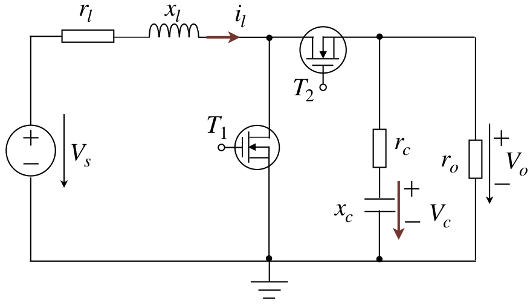
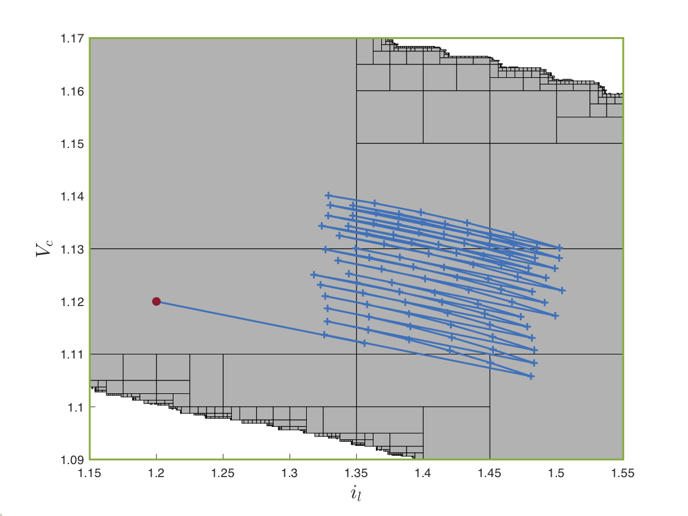
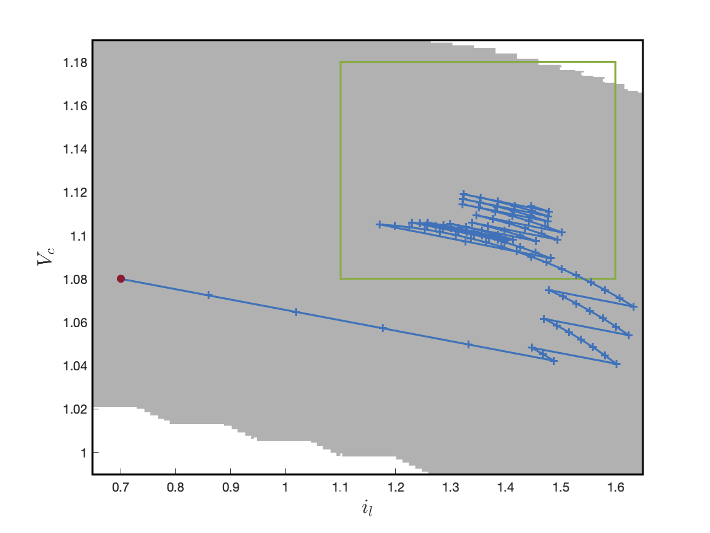
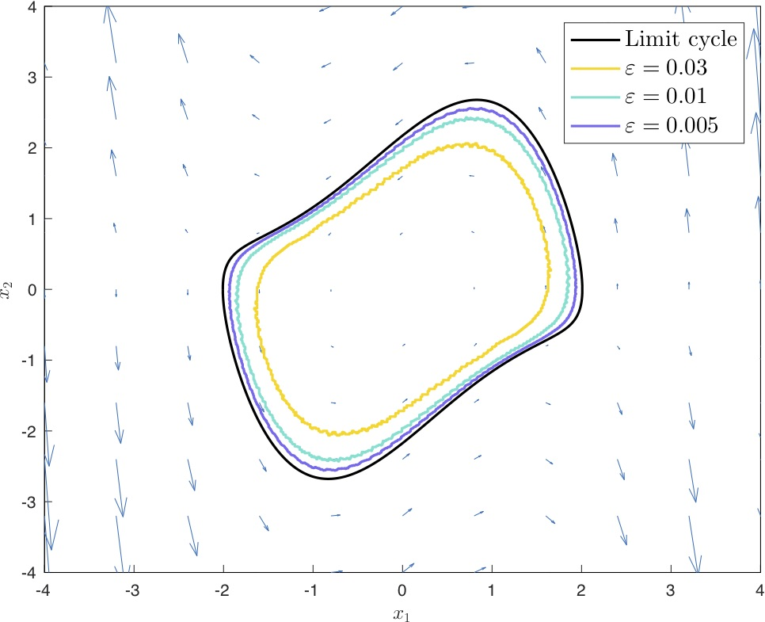
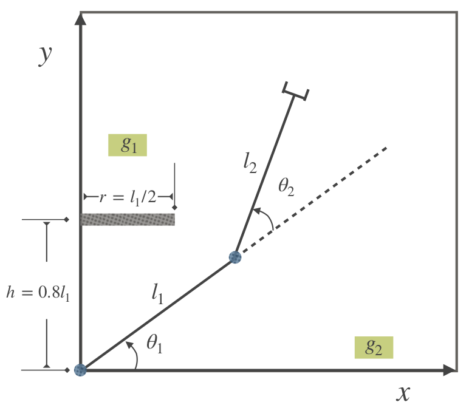
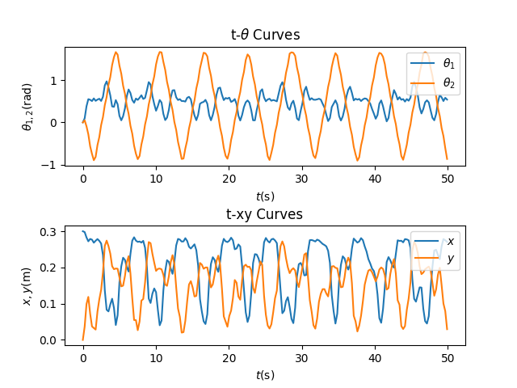
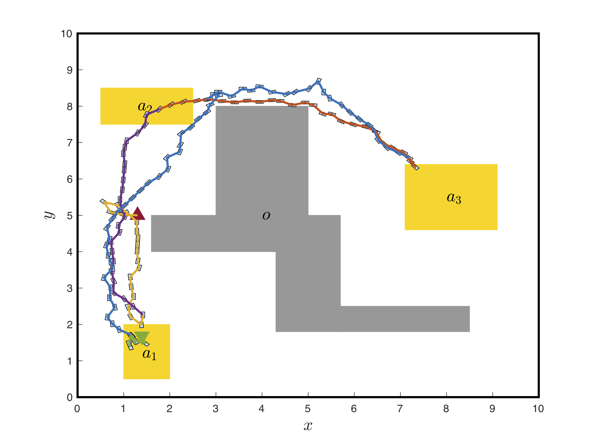
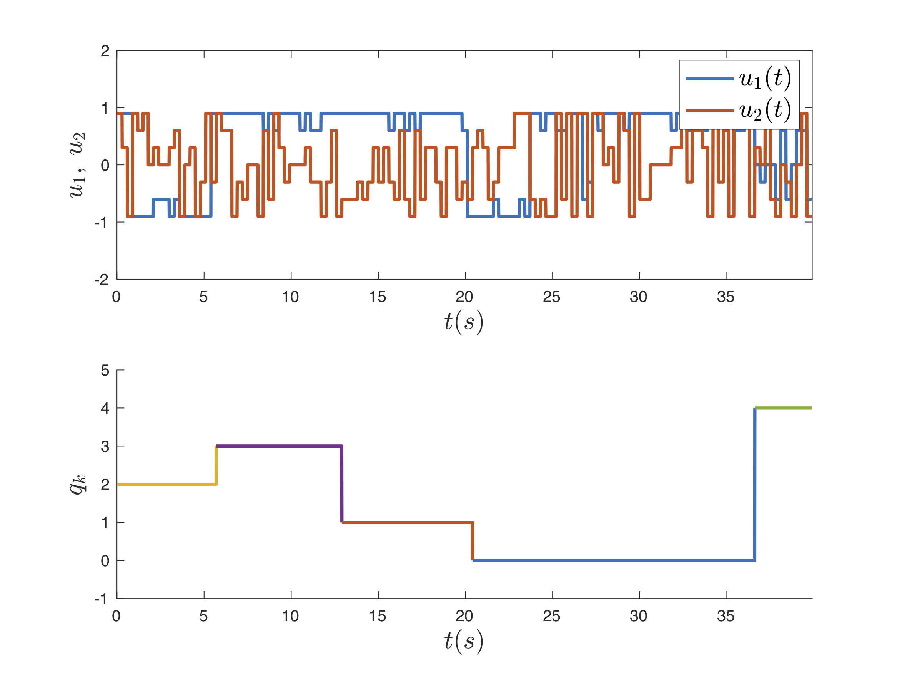
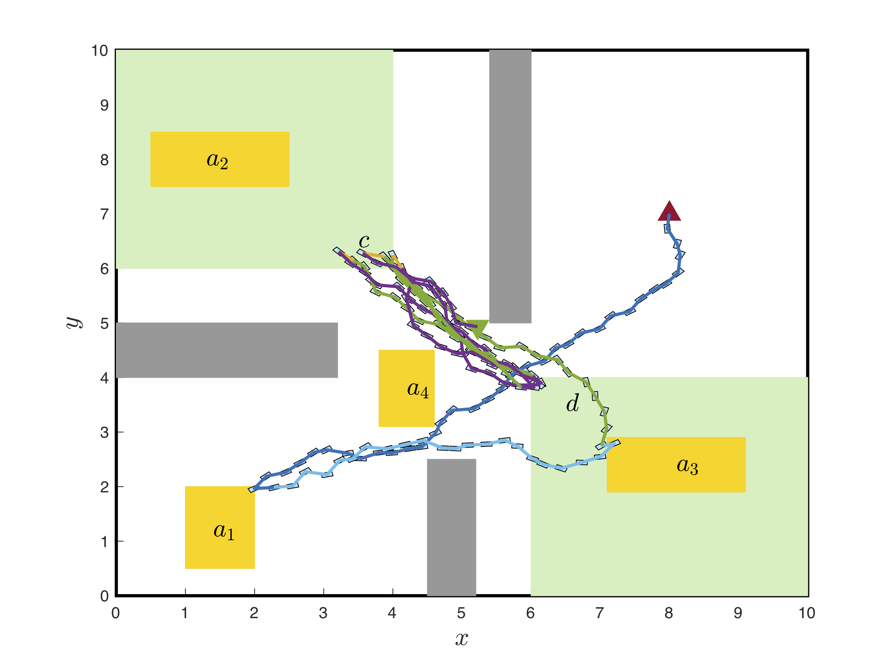
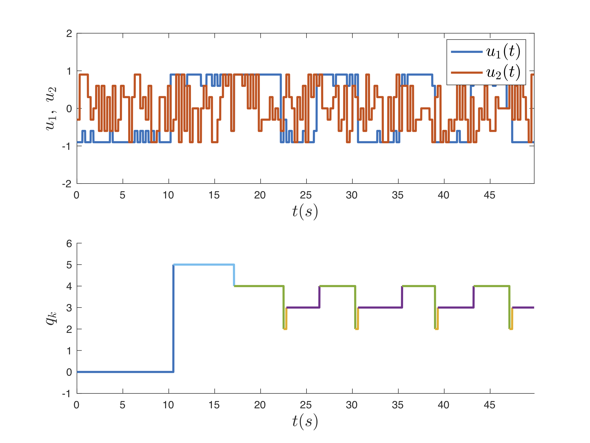

Case Studies
===============
In this section, we study some control problems and show the control synthesis results by using ROCS. All the codes can be found in the source code.

Boost DC-DC Converter
---------------------

The dynamics can be captured by a switched linear system with two modes [LL2018]_:

.. math::

   \dot{x} & = A_{1,2}x+b,\quad x = \begin{bmatrix} i_l\\ V_c \end{bmatrix}\\
   A_1 & = \begin{bmatrix} -\frac{r_l}{x_l}&0\\0&-\frac{1}{x_c(r_c+r_o)}\end{bmatrix},\, A_2 = \begin{bmatrix} -\frac{1}{x_l}(r_l + \frac{r_or_c}{r_o+r_c})&-\frac{r_o}{x_l(r_o+r_c)}\\ \frac{r_o}{x_c(r_o+r_c)}&-\frac{1}{x_c(r_o+r_c)}\end{bmatrix},\,\quad b=\begin{bmatrix} \frac{V_s}{V_l}\\ 0 \end{bmatrix}.

Let the state space be :math:`\mathcal{X}=[0.6490,1.6500]\times[0.9898,1.1900]`. A typical function of a boost DC-DC converter is to regulate the output voltage :math:`V_o` within a certain range. Depending on whether the initial state :math:`x_0` of the system falls inside this range or not, such a control objective can be described as an invariance specification or a reach-and-stay specification. Consider an invariance specification and :math:`\varphi_{\rm inv}=\Box a` and a reach-and-stay specification :math:`\varphi_{\rm rs}=\lozenge\Box b`. The atomic propositions :math:`a` and :math:`b` are assinged, by the labeling functions, to the areas

.. math::

   \Omega_1 & = [1.15,1.55]\times[1.09,1.17],\\
   \Omega_2 & = [1.10,1.6]\times[1.08,1.18],

respectively.

By using methods ``CSolver.invariance_control`` and ``CSolver.cobuchi`` provided in ROCS to synthesize w.r.t. these two specifications, we can get the following closed-loop simulation results.

|inv|  |rs|

The shaded areas are the winning sets approximated, and closed-loop phase portraits for both specifications are displayed as blue lines from given initial states (the red dots).

ROA of reversed Van der Pol System
----------------------------------
ROCS can also be used for analyzing properties of dynamical systems [LL2020]_. In this case study, we aim to inner-approximate the region of attraction (ROA) of a reversed Van der Pol system, whose dynamics is

.. math::

   \dot{x}_1 & = -x_2,\\
   \dot{x}_2 & = x_1+(x_1^2-1)x_2.

The ROA of a dynamical system is a subset of initial conditions from which the solution converges to the origin. By using a linearized model, a small subset of the ROA can be determined analytically. Then the ROA estimation problem can be considered as a reach-and-stay or reachability problem, which can be solved by using ROCS. Smaller partition precision used in ROCS will give a more accurate approximation of the ROA, as shown in :ref:`figure_roas`.

.. _figure_roas:

   ROA approximations

SCARA Manipulator
-----------------
SCARA (Selective Compliant Articulated Robot for Assembly) is a type of manipulators that are operate on a horizontal plane. They are often used for vertical assembly tasks in industry. In this case study, we consider a two-link SCARA manipulator in the following workspace [LSL2021]_.

The dynamics is highly nonlinear:

.. math::

   \dot{\theta}_1 & = \omega_1,\\
   \dot{\theta}_2 & = \omega_2,\\
   \dot{\omega}_1 & = \frac{z_3\tau_1+z_2z_3s_2(2\omega_1+\omega_2)\omega_2+(z_3+z_2c_2)(z_2\omega_1^2s_2-\tau_2)}{z_3(z_1-z_3)-z_2^2c_2^2},\\
   \dot{\omega}_2 & = \frac{(z_1+2z_2c_2)(\tau_2-z_2\omega_1^2s_2)-(z_3+z_2c_2)(\tau_1+z_2s_2(2\omega_1+\omega_2)\omega_2)}{z_3(z_1-z_3)-z_2^2c_2^2},

where :math:`c_2=\cos(\theta_2)`, :math:`s_2=\sin(\theta_2)`, :math:`z_1=I_1+I_2+m_1r_1^2+m_2(l_1^2+r_2^2)`, :math:`z_2=m_2l_1r_2`, and :math:`z_3=I_2+m_2r_2^2`.

The end-effector mounted at the end of the fore arm is required to visit area :math:`g_1` and :math:`g_2` infinitely often (:math:`\varphi=\Box\lozenge g_1\wedge\Box\lozenge g_2`. The classic approach to solving such a control problem is to design the trajectories that satisfy the geometry constraints and a tracking controller independently. Since the constraints are dealt with only in trajectory generation, there is no guarantee that no collision will occur during tracking. ROCS can help design a provably correct controller such that the specification can be satisfied without collision. The closed-loop simulation result is shown as follows.

|animation|  |curves|

.. |animation| image:: figures/scarareplay.*
   :width: 330

.. _sec_mobile:

Mobile Robot
------------
This is a typical formal control synthesis case study [LSL2021]_. The following kinematics of the mobile robot is considered.

.. math::

   \dot{p}_x & = v\cos(\gamma+\theta)\cos(\gamma)^{-1},\\
   \dot{p}_y & = v\sin(\gamma+\theta)\cos(\gamma)^{-1},\\
   \dot{\theta} & = v\tan(\phi),

where :math:`\gamma=\arctan (\tan (\phi)/2)`.

Here we show the control synthesis results for two different specifications:

- :math:`\varphi_1=\lozenge(a_1\wedge\lozenge(a_2\wedge\lozenge(a_3\wedge(\neg a_2)\mathbf{U} a_1)))`, which specifies the order of areas that the vehicle has to visit: :math:`a_1\to a_2\to a_3\to\neg a_2\to a_1`, and
- :math:`\varphi_2=\lozenge(a_1\wedge\lozenge a_3)\vee\lozenge(a_2 \wedge(\neg a_4 \mathbf{U} a_3))\wedge \Box\lozenge c\wedge\Box\lozenge d`: in addition to visiting areas :math:`c` and :math:`d` repeatedly, go to :math:`a_1` then :math:`a_3` or :math:`a_2` then :math:`a_3` while avoiding :math:`a_4`.

For the specification :math:`\varphi_1`, the left figure shows the closed-loop trajectory in the 2d workspace, and the right figure is the time histories of control inputs and the DBA state.

|phi1|  |phi1_uq|

Same for the specification :math:`\varphi_2`, the results are shown in the following figures.

|phi2|  |phi2_uq|

Online Collision Avoidance
--------------------------
We can also use ROCS for online collision avoidance for mobile robots [LSL2021iros]_. This is an extension of the previous *mobile robot motion planning* example.

Consider a dynamic environment where moving obstacles might appear in local areas in the world map. The motion of obstacles is unpredictable to the robot. Now the control problem is: given an LTL formula, design a controller such that the LTL formula is satisfied without colliding with moving obstacles.

Assume that the moving obstacle has bounded linear and angular velocities. The robot is assumed to be equipped with a range-bearing sensor (e.g., LiDAR), which can be used to detect and derive the relative state of the obstacles to itself within a certain range.

To solve the prblem, we perform in offline

- control synthesis w.r.t. a given LTL mission on the world map, and
- invariance control synthesis to guarantee safety.

Two controllers are combined together online to achieve the task. Here are two simulation scenarios:

|caseI|  |caseIV|

.. |caseI| image:: figures/ca.*
   :width: 330
.. |caseIV| image:: figures/ca_multi.*
   :width: 330

