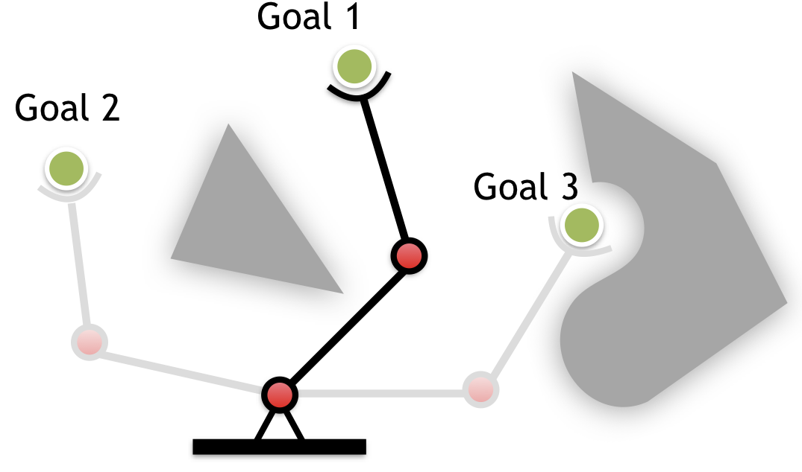
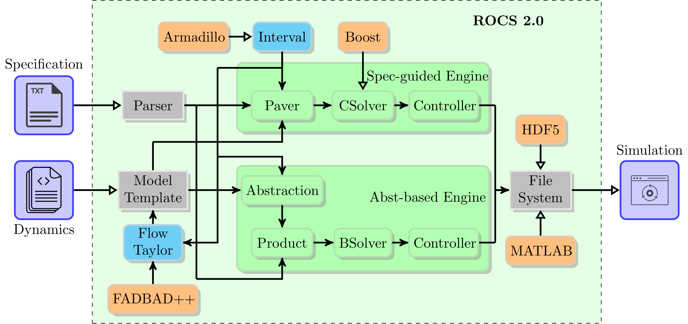
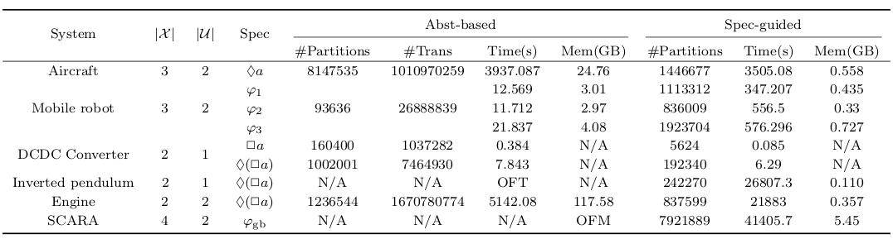

.. rocs documentation master file, created by
   sphinx-quickstart on Tue Jun 22 17:21:41 2021.
   You can adapt this file completely to your liking, but it should at least
   contain the root `toctree` directive.

ROCS in Control Synthesis
==========================

ROCS is a C++ library to solve formal control synthesis problems for nonlinear dynamical systems w.r.t. temporal logic specifications. Such control problems deal with

- hybrid system behaviors and/or
- complex control specifications, e.g., `linear-time properties <https://en.wikipedia.org/wiki/Linear_time_property>`_, that are beyond classic control objectives such as stabilization.

**An explanatory example**

The following :ref:`figure_arm` is a nonlinear mechanical system driven by the motors at two joints. By controlling the angles of both arms, the end effector may reach a given position in the operational space. The mission of this manipulator is to finish tasks in different goal areas, but the manipulator has to reach those goal areas in the order: *visit `goal 1` first, then `goal 2`, and last to `goal 3`, but `goal 1` needs to be avoided before reaching `goal 3`*.

.. _figure_arm:

   two-link manipulator

In this example, the specification is very high-level compared to conventional control objectives. No initial state is specified and there might be disturbance during the mission execution.

To solve such problems, ROCS utilizes **temporal logic formulas** to describe the control objective and **formal algorithms** to synthesize a feedback controller. As opposed to *posteriori* control methods, formal methods are now more favorable for safety-critical systems because

- the set of initial conditions, where feedback controllers exist to realize the specification, (a.k.a. *winning set*) can be computed,
- a feedback controller will be determined for each state in the winning set,
- the synthesized controllers are correct by construction, and
- control synthesis can be performed automatically.

Getting Started
---------------

To start your experience with ROCS, you may want to follow these steps:

- Prepare the environment: :doc:`Installation <install>`
- Test installation by running the existing examples: :doc:`Case Studies <cases>`
- Create your own examples: :doc:`User Guide <manual>`
- A deeper look into the solvers: :doc:`Methodology <theory>`

Why ROCS?
---------
ROCS is able to deal with general nonlinear dynamics and a class of LTL formulas that can be translated into deterministic Buechi automata (DBA). Dealing with DBA is more practical in nonlinear control synthesis. Synthesizing a full LTL specificaiton for a nonlinear system is usually cost prohibitive in time and space.

Features
^^^^^^^^

* It provides two control synthesis engines (see :doc:`Methodology <theory>` for further details):

  + **Abstraction-based** engine: a commond method used in other tools (e.g., `SCOTS <https://gitlab.lrz.de/hcs/scots>`_, `TuLip <https://tulip-control.sourceforge.io/>`_). The version implemented in ROCS is optimized in both time and space.

  + **Specification-based** engine: only available in ROCS, which is generally much more memory efficient than the abstraction-based engine.

* It supports control synthesis with respect to LTL formulas that can be translated into deterministic Buechi automata (DBA);
* It supports control synthesis for sampled-data systems by incoporating Taylor models of ODE solutions. No analytical bounds, e.g., growth functions, are needed.
* It provides `Python` and `Matlab` APIs for simulating control synthesis results.

ROCS Architecture
^^^^^^^^^^^^^^^^^

How to choose a solver engine?
------------------------------
For low dimensional systems (<= 2d), simple dynamics, and simple LTL specifications such as invariance and reachability, both engines performs similarly.

For higher dimensional systems with more complicated dynamics and

- choose the abstraction-based engine if

  * you have enough memory,
  * no varying discretization precision needed according to the dynamics.

- choose the specification-guided engine if

  * you have limited memory,
  * system dynamics has distinct fast and slow flows in different areas in the state space.

The following :ref:`figure_perf` [#f1]_ may serve as a reference for choosing the engine. The table summarizes the runtime and memory test results of examples: *aircraft safe landing* [RWR2017]_, *DCDC converter* [ROCS2018]_, [LL2018]_, *inverted pendulum stabilization* [LL2020]_, *Moore-Greitzer engine operation point control* [LSL2021]_, *mobile robot* [LSL2021]_, and *SCARA manipulator motion planning* [LSL2021]_. The run time for abstraction-based method is the sum of the time for abstraction and synthesis. All examples were tested on the high performance computing (HPC) cluster `Beluga <https://docs.computecanada.ca/wiki/B\'eluga/en>`_ for benchmarking examples. Every test runs sequentially on a node with Intel Xeon(R) Gold 6148 processor @2.40GHz. Each node is allocated a maximum of 750GB of memory.

.. _figure_perf:

   performance test on benchmarks [ROCS2021]_

For the mobile robot, :math:`\varphi_1=\lozenge(a_1\wedge\lozenge(a_2\wedge\lozenge(a_3\wedge(\neg a_2)\mathbf{U} a_1)))`, :math:`\varphi_2=\bigwedge_{i=1}^{3} \Box\lozenge a_i`, and :math:`\varphi_3=\bigwedge_{i=1}^{3}\lozenge a_i`. For the SCARA manipulator, :math:`\varphi_{\rm gb}=\Box\lozenge g_1\wedge\Box\lozenge g_2`.

.. toctree::
   :maxdepth: 2
   :hidden:

   install
   theory
   cases
   manual
   api
   plan

Indices and tables
==================

* :ref:`genindex`
* :ref:`modindex`
* :ref:`search`

.. rubric:: Footnotes

.. [#f1] The memory used in DCDC converter example is unable to be collected due to short run time. `OFM` = out of memory, `OFT` = >24h.

.. [ROCS2018] `Y. Li, J. Liu, ROCS: A Robustly Complete Control Synthesis Tool for Nonlinear Dynamical Systems. In Proceedings of the 21st International Conference on Hybrid Systems: Computation and Control (HSCC '18). <http://dl.acm.org/citation.cfm?doid=3178126.3178153>`_

.. [ROCS2021] Y. Li, Z. Sun, and J. Liu (2021), ROCS 2.0: An Integrated Temporal Logic Control Synthesis Tool for Nonlinear Dynamical Systems. 7th IFAC Conference on Analysis and Design of Hybrid Systems (ADHS 2021).
	 
.. [RWR2017] `Reissig, G., Weber, A., and Rungger, M. (2017). Feed-back refinement relations for the synthesis of symboliccontrollers. IEEE Trans. Automat. Contr., 62(4), 1781–1796. <http://ieeexplore.ieee.org/document/7519063/>`_

.. [LL2018] `Y. Li, J. Liu (2018), Invariance Control Synthesis for Switched Nonlinear Systems: An Interval Analysis Approach. IEEE Trans. Automat. Contr., 63(7), 2206-2211. <http://ieeexplore.ieee.org/document/8062786/>`_

.. [LL2020] `Y. Li, J. Liu (2020), Robustly Complete Synthesis of Memoryless Controllers for Nonlinear Systems with Reach-and-Stay Specifications. ArXiv: 1802.09082v2. <http://arxiv.org/abs/1802.09082v2>`_

.. [LSL2021] `Y. Li, Z. Sun, and J. Liu (2021), A Specification-Guided Framework for Temporal Logic Control of Nonlinear Systems. ArXiv:2104.01385 <https://arxiv.org/abs/2104.01385>`_

.. [LSL2021iros] Y. Li, E.M. Shahrivar, J. Liu (2021), Safe Linear Temporal Logic Motion Planning in Dynamic Environments. Accepted by 2021 IEEE/RSJ International Conference on Intelligent Robots and Systems (IROS 2021).
