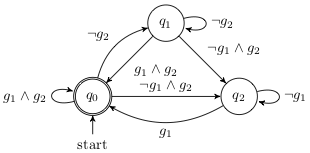

User Guide
==========
Running temporal logic control synthesis is more than just a single line of code. The user needs to

- specify the system dynamics, which falls into the following categories:

  * continuous/discrete-time dynamical systems without controls :math:`\dot{x}=f(x)`/:math:`x^+=f(x)`;
  * continuous/discrete-time switched systems in the form of :math:`\dot{x}=f_u(x)`/:math:`x^+=f_u(x)`, where the control input :math:`u\in\mathbb{Z}` indicates the system mode;
  * continuous/discrete-time control systems in the form of :math:`\dot{x}=f(x,u)`/:math:`x^+=f(x,u)`;

- specify the control specification, which can be

  * invariance: :math:`\varphi=\Box a`, or
  * reachability: :math:`\varphi=\lozenge a`, or
  * an LTL formula that can be translated into a DBA,

- save the resulting control synthesis strategies in either

  * the `MATLAB` file format or
  * the `HDF5` file format

- prepare a simulation file to examine the closed-loop performance.

This manual will walk you through a typical formal control synthesis procedure, which includes the above points.

Prepare the Main Program
------------------------
The first step to solving a control synthesis problem is to create a C++ `main` program that manages the workflow from the inputs of system dynamics and specifications to the output of control strategies. Such a file typically consists of:

- read the control specification,
- define the system dynamics,
- assign labels to the areas in the state space by the labeling function,
- call a proper control synthesis algorithm, and
- save control strategies.

In the following sections, we will show you how to write each part.

..
   .. literalinclude:: ../rocs/examples/car/carDBA.cpp
	  :language: cpp
	  :lines: 16-

Structure Your Specification
----------------------------
To perform control synthesis w.r.t. a DBA specification, a structured file describing the DBA is required currently. An acceptable specification file should contain

- metadata about the DBA such as the equivalent LTL formula, the number of states, accepting states, atomic propositions and so on.
- all the transitions (or edges) between states in the DBA, which are given in the order of *from state*, *proposition of the edge*, *to state*.

The format of the file is consistent with the Hanoi Omega Automata (HOA) format, which is a text-based format for many types of finite automata over infinite words, i.e. :math:`\omega` -automata. To write such a specification file, the user can use the online translator `Spot <https://spot.lrde.epita.fr/app/>`_, which converts LTL formulas to the corresponding :math:`\omega` -automata.

Consider the generalized Buechi specification :math:`\varphi_{\rm gb}=\Box\lozenge g_1\wedge\Box\lozenge g_2` whose DBA translation is

.. _figure_gb2:

   The DBA of the generalized Buechi formula.

The following structured text file is a transciption of the above DBA, which can be parsed by ROCS.

.. literalinclude:: ../rocs/examples/scara/gb2.txt
   :linenos:

Lines 1-6 are the metadata. The keywords (case sensitive) ``Name``, ``AP``, ``acc``, ``nNodes``, ``nAP`` and ``init`` should be used to indicate the corresponding LTL formula, the atomic proposition, the accepting states, the number of DBA states, the number of atomic propositions, and the initial state, respectively. The order of presenting these information does not matter.

.. note::
   To use ROCS, there can be multiple accepting states while the initial state is unique. Separate different accepting states by comma in the specification file, e.g., ``acc=0,3,5``.

Starting from line 8, transitions of the DBA are given in the form of a matrix enclosed by ``M=[]``. Each line represents a transition from the starting state (column 1) to the ending state (column 3), as commented in line 7. The propositional formula enabling each transition is given in column 2 by the decimal value of its binary code.

The binary encoding of a propositional formula projects the formula into a binary code, which contains ``nAP`` bits (or binary digits). Each bit corresponds to an atomic proposition. The value of the bit is 1 when the atomic proposition is true; otherwise it is 0. In the above exmaple, :math:`g_1` is represented in the lower bit and :math:`g_2` the higher bit. Thus, :math:`g_1\wedge g_2=\set{11}=\set{3}`, and :math:`g_1=\set{10,11}=\set{2,3}` and so forth.

In the `main` program, read the sepcification file by using ``read_spec``:

.. literalinclude:: ../rocs/examples/car/carDBA.cpp
   :language: cpp
   :lines: 64-69
   :linenos:

.. note::
   For the **invariance** and **reachability** control specifications, specialized control algorithms can be used directly. Specifically, instead of using a specification file that represents its corresponding DBA, the user can alternatively (recommended)

   - call methods ``invariance_control`` and/or ``reachability_control`` of the class ``CSolver`` if the specification-guided engine is used. In this case, the *goal* and *avoid* areas in the state space of the system needs to be specified firstly by using the ``init`` method.
   - call methods ``invariance`` and/or ``reachability`` of the class ``DSolver`` if the abstraction-based engine is used. In this case, the user needs to prepare a set of goal states (of type ``std::vector<size_t>``) before using those methods.

     

Structure Your Dynamics
-----------------------
The system dynamics can be written either

- directly in the `main` file or
- in a separate header file.

Take the :ref:`mobile robot <sec_mobile>` problem in the :doc:`Case Studies <cases>` as an example, the vehicle dynamics is definded as a `struct` in the following header file `car.hpp`:

.. literalinclude:: ../rocs/examples/car/car.hpp
   :language: cpp
   :lines: 11-
   :linenos:

.. note::
   Define your dynamics by using the ``typename S`` as in the example.

In the `main` file, create a system object by using the ``carode`` `struct`:

.. _code_dt:
.. literalinclude:: ../rocs/examples/car/carDBA.cpp
   :language: cpp
   :lines: 87-97
   :linenos:
   :caption: setting up a discrete-time system

The mobile robot is a discrete-time control system, and therefore the system type ``DTCntlSys`` is used in line 9. Please use the correct type for your system:

- Discrete-time control systems: ``DTCntlSys``;
- Discrete-time switched systems: ``DTSwSys``;
- Discrete-time systems without controls: ``DTSys``;
- Continuous-time control systems: ``CTCntlSys``;
- Continuous-time switched systems: ``CTSwSys``;
- Continuous-time systems without controls: ``CTSys``.

Typically, line 10 and 11, which initialize the state space and the set of sampled control inputs, respectively, are followed immediately after the control system object is created. For systems without controls or switched systems, only line 10 needs to be applied.

To handle continuous-time systems, high-order Taylor expansion is used to compute a validated reachable set after one sampling time for each cell in the system state partition, which is required by the control synthesis algorithms. The class ``flowTaylor`` is designed to compute validated reachable sets. Here is an example code for setting up a continuous-time system.

.. _code_ct:
.. literalinclude:: ../rocs/examples/vdp/roa.cpp
   :language: cpp
   :lines: 55-68
   :linenos:
   :caption: setting up a continuous-time system

Compared to :ref:`code_dt`, there are extra lines:

- Line 14 allocates memory for an ``flowTaylor`` object for validated reachable set computation. Since new memory is allocated, the following line of code shall be used at the end of the `main` program.

.. code-block:: cpp

   vdproa.release_flows();

- Line 5-9 provide the parameters for validated reachable set computation (see :ref:`C++ APIs <sysparams>` and [LL2020]_ for the explanation of the parameters.)

.. note::
   The parameters used in :ref:`code_ct` work for many dynamical systems. You may need minor modifications, but it is not suggested to change them without using them for your system first.
   

Define the Labeling Function
----------------------------
A labeling function connects the atomic propositions or propositional formulas given in the control specification to certain areas in the state space of the dynamical system. One way to define a labeling function is through the use of a `lambda function <https://docs.microsoft.com/en-us/cpp/cpp/lambda-expressions-in-cpp?view=msvc-160>`_.

If the *specification-guided engine* is to be used, then, first of all, we need to create ``nNodes``  ``CSolver`` objects, where ``nNodes`` is the number of states in the DBA specification. This is due to the structure of the overall DBA control strategy: the DBA is embedded to update the controller memory of the current DBA state. The implementation of such a control strategy in the *specification-guided engine* works on ``nNodes`` copies of ``CSolver`` objects. Each such object holds and controls the partition of a copy of the state space that corresponds to one of the DBA states. The control strategy for each DBA state will then be computed and stored in the corresponding ``CSolver`` object, which can be applied whenever its corresponding DBA state is activated.

As a result, the labeling procedure needs to performed for all the ``CSolver`` objects by the member function ``labeling`` in the solver class ``CSolver``. Here is an example with the same mobile robot model:

.. _code_label_csolver:
.. literalinclude:: ../rocs/examples/car/carDBA.cpp
   :language: cpp
   :lines: 98-115,121-136
   :linenos:
   :caption: Labeling with CSolver

Line 23-34 is a lambda function that creates ``nNodes`` copies of ``CSolver`` objects as well as assigns the labels to specify goal and avoid areas in each of the object. Specifically,

- line 1-18 specify the 3d rectangular goal and avoid areas.
- line 22 specifies the labels of all the areas involved,
- Line 28 creates ``nNodes``  ``CSolver`` objects, which are labeled in line 30, 32, and
- the pointers to all these ``CSolver`` objects are collected in a vector ``w`` in line 20.

Similarly, if the *abstraction-based engine* is to be used, then an abstraction of the system needs to be defined first, and a lambda function can be used for labeling. In the following code example,

- the first 2 lines define and initialize an abstraction of the mobile robot system,
- line 9 constructs all the transitions between abstraction states,
- line 18-35 assign different labels 4, 2, 1 to 3 rectangular goal areas, and the lambda function defined in line 22-34 serves as the labeling function.

.. literalinclude:: ../rocs/examples/car/carAbst.cpp
   :language: cpp
   :lines: 86-88,115-125,139-160
   :linenos:

.. note::
   The labels used in the labeling function should be obtained by the same binary encoding as the ones in the specification.

Perform Synthesis
-----------------
To perform the control synthesis algorihm with the *specification-guided engine*, the method ``dba_control`` should be used. Let us still look at the mobile robot example. The following line of code will perform the control synthesis w.r.t. the user-defined DBA specification for the mobile robot system.

.. literalinclude:: ../rocs/examples/car/carDBA.cpp
   :language: cpp
   :lines: 144-145
   :linenos:

The first input argument ``w`` is a vector of pointers to the ``CSolver`` objects, which has been created in :ref:`code_label_csolver` when we define the labeling function. Each such object is associated to a different DBA state. In some cases where only a sub-graph of the entire DBA is concerned with, only the pointers to the ``CSolver`` objects related to the sub-graph need to be collected in ``w``. Hence, the size of ``w`` could be smaller than ``nNodes``. After the control sythesis finishes, a control strategy for each DBA state will be stored in the corresponding ``CSolver`` object. In this way, ``w`` is also a returning argument from which we can save the control strategies for the corresponding ``CSolver`` objects to a file.

The input argument ``sdoms`` is a vector of pointers to the system state spaces possessed by all the ``CSolver`` objects, and the size of ``sdoms`` is ``nNodes``. Since non-uniform partitions will be generated during control synthesis, a tree structure is used for representing each of the state space. Winning set will be marked in such a tree data structure. The ``sdoms`` is needed even when only a sub-graph of the DBA is considered, and an index mapping ``oid`` will be used to convert the index of the vector ``w`` to the corresponding index in ``sdoms``.

The input function ``init_w`` is the lambda function we defined earlier for labeling, and ``e`` is the partition precision specified by the user. The argument ``isacc`` is a vector of binaries of size ``nNodes``, which marks the accepting states. It can be obtained by using the ``acc`` after reading the specification file. Here is a code example:

.. literalinclude:: ../rocs/examples/car/carDBA.cpp
   :language: cpp
   :lines: 72-74
   :linenos:

To use the *abstraction-based engine*, there will be 4 steps:

- construct a DBA from the information read from the specification file,
- load the abstraction that has been constructed,
- generate the product system of the DBA and the abstraction, and
- run a Buechi game algorithm over the product.

Here is an example code (for the mobile robot model):

.. literalinclude:: ../rocs/examples/car/carAbst.cpp
   :language: cpp
   :lines: 163-175
   :linenos:

Save control synthesis results
^^^^^^^^^^^^^^^^^^^^^^^^^^^^^^
In order to run closed-loop simulations, you need to write several lines of code to save control synthesis results as well as problem settings to one of the following two data formats:

- the `HDF5` format (a `.h5` file), and
- the `MATLAB` data format (a `.mat` file).

It is encouraged to use the `HDF5` format although `.h5` and `.mat` are interchangeable. This is because `HDF5` is open distributed and also the base for the `.mat` format. For non-MATLAB users, the installation of `HDF5` is necessary in order to use the Python interfaces. Besides, the generation of `.mat` files requires the installation of `MATLAB`.

To save the control strategies that are obtained by using the *specification-guided engine* into files,

- use the method ``write_csolvers_to_h5`` for writing `.h5` files, or
- use the method ``write_results_to_mat`` for writing `.mat` files.

The control strategy for each DBA state (or associated with each ``CSolver`` object) will be written into a single file. In other words, if there are :math:`|Q|` states in the DBA, then :math:`|Q|` number of `.h5` files will be generated.

To save problem settings (such as system states, discretization precision) as well as the control strategies that are obtained by using the *abstraction-based engine* into `.h5` files, the user can refer to the following example code:

.. literalinclude:: ../rocs/examples/car/carAbst.cpp
   :language: cpp
   :lines: 196-200
   :linenos:

.. note::
   Writing to `.mat` files is not supported for the control systhesis with the  *abstraction-based engine*.

Compile and run
^^^^^^^^^^^^^^^
So far, we have had the `main` program ready for control synthesis. The last step before running the actual control synthesis algorithms is to compile the `main` program. For this purpose, we suggest to prepare a `Makefile` under the same folder as the `main` program. The user can copy the `Makefile` from any existing examples and modify the compiling rules as needed. For example, if you have a `main` program called ``main.cpp``, then modify the rule to

.. code-block:: make

   main: main.o $(OBJS)
	   $(CXX) $(CXXFLAGS) $(INCS) $^ -o $@ $(LDFLAGS) $(LIBS)

Then type ``make main`` in the terminal.

Simulate Your Result
--------------------
It is important to run closed-loop simulation to test the control performace once you have the control synthesis results generated. In this last section, we will see how to interpret the data saved in `.h5` or `.mat` files and how to use them to do simulation.

You may expect the following data variables in each `.h5` or `.mat` file generated by using the *specification-guided engine*:

- ``U``: a 2d array representing the set of sampled control inputs. Each row is a control input value, and the number of rows is the number of control inputs (let's say :math:`|U|`). The input dimension determines the number of the columns.
- ``X``: an :math:`n\times 2` matrix representing the state space, where :math:`n` is the system dimension.
- ``ts``: the sampling time.
- ``pavings``: an array of intervals representing the non-uniform partition of the system state space. Each row represents an interval (or cell). There are :math:`2n` columns, which specify the lower and upper bounds in each dimension. The number of rows is the total number of cells (let's say :math:`N`) in the partition.
- ``tag``: a binary array of size :math:`N` indicating the winning set of the control problem. If a cell belongs to the winning set, the corresponding row is 1; otherwise 0.
- ``ctlr``: a 2d binary feedback control table with :math:`N` rows and :math:`|U|` columns. The value 1 at row :math:`i` column :math:`j` means that the :math:`j` th control input can be used to realize the given control specification when the current system state belongs to the :math:`i` th interval (or cell).

Here we show how to use the above data for simulation by a python code example:

.. code-block:: python
   :linenos:

   if(any(ctlr[q][x_id, :])):
        uset = np.argwhere(ctlr[q][x_id, :]).squeeze()  # get the indices of valid input
   else:
        print("No valid control input.")

   if(uset.size > 1):
        uid = rng.choice(uset, 1)  # randomly pick one
   else:
        uid = int(uset)
   u = U[uid, :].squeeze()

Since there is one `.h5` or `.mat` file for each DBA state, all the control tables ``ctlr`` are put into a `Python` list after reading from the files. In line 1 of the above code, ``ctlr[q]`` is the control table corresponds to the DBA state :math:`q`.

In the `.h5` file generated by using the *abstraction-base engine*, the data variables ``U``, ``X``, and ``ts`` are also included. Besides, there are the following additional data variables:

- ``eta``: the discretization precision with the same dimension as the system state.
- ``xgrid``: an array of discretized states of the system. Each row represents a state. There are :math:`N` rows and :math:`n` columns, where :math:`N` is the number of the discrete states and :math:`n` is the system state dimension.
- ``WinSet``: the winning state indices. The size of ``WinSet`` is the size :math:`N_{\rm win}` of the winning set.
- ``OptCtlr``: an array of control pairs :math:`(q,u)`, where :math:`q` and :math:`u` are the indices of DBA state and control input, respectively. To look for a control input :math:`u` to realize the specification, we need the current system state and DBA state.
- ``nts_ctrlr``: a table with :math:`N_{\rm win}` rows and 3 columns. The :math:`i` th row stores the keys for looking up the corresponding control input for the :math:`i` th state in the winning set ``WinSet``. The columns represent the number of rows in ``OptCtlr`` to be searched, the label of the current system state, and the starting row in ``OptCtlr``, respectively.
- ``encode3``: an index mapping that maps the indices of the states in ``xgirds`` to the indices in ``nts_ctrlr``, i.e., matches row indices between ``xgrids`` abd ``nts_ctrlr``.
- ``q_prime``: an array that encodes the DBA state update mechanism.

Let us assume that the current system state :math:`x` corresponds to the :math:`i` the state in ``xgrid``. To determine the control input for ``xgrid[i]``, we should look at the ``encode3[i]`` th row of ``nts_ctrlr``, which is ``p5=nts_ctrlr[encode[i],...]``. Then ``p5[2]`` gives the starting row in ``OptCtlr`` to look for the actual control input, and ``p5[0]`` is the number of row we should search from the starting row. If the current DBA state index is :math:`q_c`, then we search among these rows to find the pairs with :math:`q=q_c`. The control input :math:`u` paired with :math:`q_c` is the control input we are looking for :math:`x`. Here is a sample Python code for retreiving the control input for the :math:`i` the state in ``xgrid``:

.. code-block:: python
   :linenos:

   p5 = nts_ctrlr[encode3[i], ...]
   p7 = ctlr[p5[2]:p5[2]+p5[0], ...]
   uset = np.argwhere(p7[:, 0] == q).squeeze()
   if(uset.size > 1):
	  uid = rng.choice(uset, 1)  # randomly pick one
   else:
	  uid = int(uset)
	  u = U[p7[uid, 1], :].squeeze()

The DBA state also needs to be update during each sampling time, and this is where you should use ``q_prime``. Let ``n_dba`` be the number of states in the DBA and ``q`` be the current DBA state. Then the following line of code updates the DBA state:

.. code-block:: python

   q = q_prime[p5[1]*n_dba+q]

Some :ref:`Python APIs <pyapi_sim>` are provided in ROCS to convenient simulation such as the ones for

- loading/reading control synthesis results or specifications: ``read_controller_itvl_from_h5``, ``read_controller_itvl_from_mat``, ``read_controller_abst_from_h5``, and ``read_spec_from_txt``.
- converting values to indices: ``index_in_interval_array``, ``index_in_grid``.
- simulation: ``simulate_itvl_dba_control``, ``simulate_abst_dba_control``

You may also use these APIs if they are actually helpful to you.
