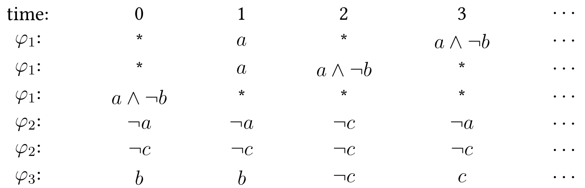

Methodology
===========

Temporal logic control in a nutshell
------------------------------------
Let us start with the **linear temporal logic (LTL)**, a formalism that can specify high-level linear-time specifications and be operated by computer programs. An LTL formula defined over an alphabet, and it consists of propositional logic operators (logic 1: :math:`\top`, conjunction: :math:`\wedge`, and negation: :math:`\neg`) and temporal operators (next :math:`\bigcirc` and until :math:`\mathbf{U}`).

An LTL formula is generated inductively according to the syntax in the Backus Naur form:

.. math::
  \varphi::=\top\mid p\mid \neg\varphi\mid \varphi_1\wedge\varphi_2\mid \varphi_1\mathbf{U}\varphi_2\mid \bigcirc\varphi,

where :math:`p` is an atomic proposition.

The semantics of LTL is defined on infinite words, i.e., infinite sequences of propositions :math:`\sigma_0\sigma_1\sigma_2\cdots`, over the alphabet :math:`2^{AP}`, where :math:`AP` is a set of atomic propositions, and :math:`\sigma_i (i\in\mathbb{N})` is a propositional formula.

**Examples**

Suppose that :math:`AP=\set{a,b,c}`. Then the following formulas

.. math::

   \varphi_1 & = (\bigcirc a)\mathbf{U}(a\wedge\neg b),\\
   \varphi_2 & = \Box(\neg a\vee \neg c),\\
   \varphi_3 & = \Box\lozenge b\to \Box\lozenge c,

can be interpreted as

ROCS works with a very general form of dynamical systems

.. math::

   x'\in f(x, u)+\mathcal{D},

- :math:`f:\,\mathbb{R}^n\times\mathbb{R}^m \to \mathbb{R}^n`: a Lipschitz continuous function,
- :math:`\mathcal{X}\subset\mathbb{R}^n`: the non-empty compact state space,
- :math:`\mathcal{U}\subset\mathbb{R}^m`: the non-empty and compact control space,
- :math:`\mathcal{D}=\left\{d\in\mathbb{R}^n \mid \|d\|_\infty\leq\delta\right\} (\delta\geq 0)`: a set of perturbations.

To connect the LTL specification and the dynamics, ROCS asks for a labeling function :math:`L:\mathcal{X}\to 2^{AP}`, which associates properties to every state in the state space of a dynamical system. The labeling function :math:`L` translates a solution of the dynamical system

.. math::

   \mathbf{x}=x_0 x_1\cdots

into an infinite word (or *trace*) :math:`\text{Trace}(\mathbf{x})=\set{L(x_t)}_{t=0}^\infty`. If the system solution :math:`\mathbf{x}` can be controlled such that :math:`\text{Trace}(\mathbf{x})` satisfies a given LTL formula :math:`\varphi`, then :math:`\varphi` is *realizable* for the system. The set of all initial conditions, from which a control strategy can realize :math:`\varphi`, is called the *winning set* of the system w.r.t. :math:`\varphi`.

A **temporal logic control synthesis problem** is to

- determine whether a given LTL specification \mathbf{x} is realizable for the system, and
- synthesize a feedback control strategy such that the trace of any closed-loop system solution satisfies :math:`\varphi` if possible.

There are two major frameworks for solving such a problem.

Abstraction-based Framework
---------------------------

The framework of abstraction-based control consists of three steps:

- Construct a finite transition system that over-approximates the original system behaviors, which is known as an *abstraction*.
- Synthesize a discrete controller that satisfies the given specification over the finite abstraction if there exists one, otherwise returns empty. Such a discrete control synthesis is usually carried out by the algorithms for solving two-player infinite games over a product system of the abstraction and the specification. Usually, the LTL specifiation will be converted into a deterministic :math:`\omega`-automaton first.
- Translate the discrete controller into a continuous one that solves the original control synthesis problem.

Specification-guided Framwork
-----------------------------

Unlike abstraction-based control, specification-guided control partitions the state space of the system incrementally with respect to both the dynamics and specification. The resulting partition of the state space is non-uniform. The Buechi game algorithm on a finite graph proceeds on the computation of the *predecessors* of a target set, which is the set of nodes that have out-going edges that point to the target set. Similarly for a dynamical system on a continuous state space, we can define the predecessor of a set of states :math:`X\subseteq\mathcal{X}` as

.. math::

   \text{Pre}^\delta(X)=\left\{x\in \mathcal{X} \mid \exists u\in\mathcal{U}, \forall d\in\mathcal{D},f(x,u)+d\in X \right\},

and hence the Buechi game algorithm can be generalized to infinite-state systems. However, exactly computing the predecessors for the system is hard.

In ROCS, predecessors are inner-approximated by a union of intervals in the ``Paver`` by using an interval branch-and-bound scheme. Under this scheme, an interval is bisected only when it is undetermined to be contained inside a predecessor and its width is greater than a given precision :math:`\varepsilon`. Hence, the approximation error can be controlled by choosing a proper :math:`\varepsilon`. The Buechi game algorithm, as well as the specific algorithms for invariance, reachability, Buechi, and co-Buechi specifications, is implemented in the ``CSolver`` based on the data structure of the ``Paver``.
